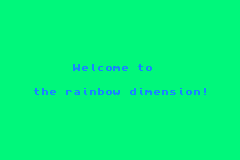

# Overview

## WARNING: FLASHING LIGHTS

This is an attempt at making something without having to look up any tutorials.

Originally just meant as a joke to taunt a friend, ended up coding a basic hue shifting routine.

# Duration
Started in: Feb 13th, 2024

Finished in: Feb 13th, 2024

# Objectives:
- Prove to myself I can make stuff without getting stuck in tutorial hell
- Substituting colours from the palettes in real time
- Making a basic hue shifting algorithm
- Having fun and making something I can be proud of

# Status:
- All objectives complete

